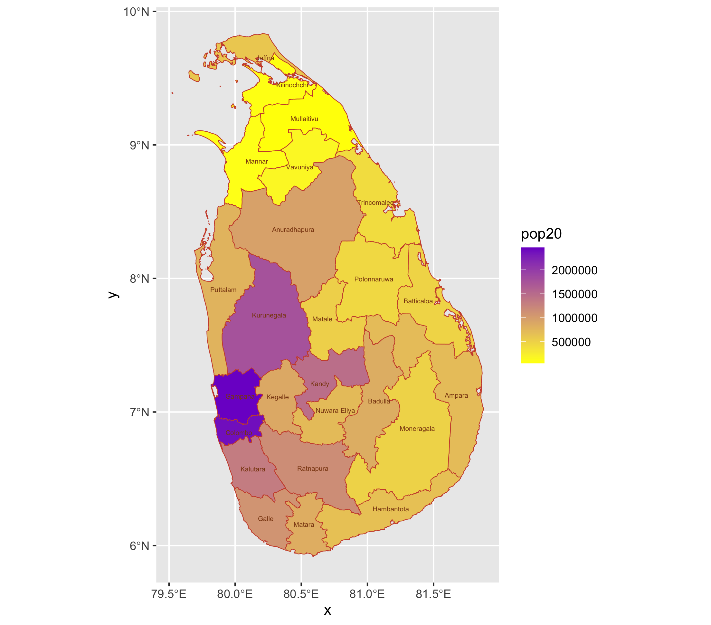
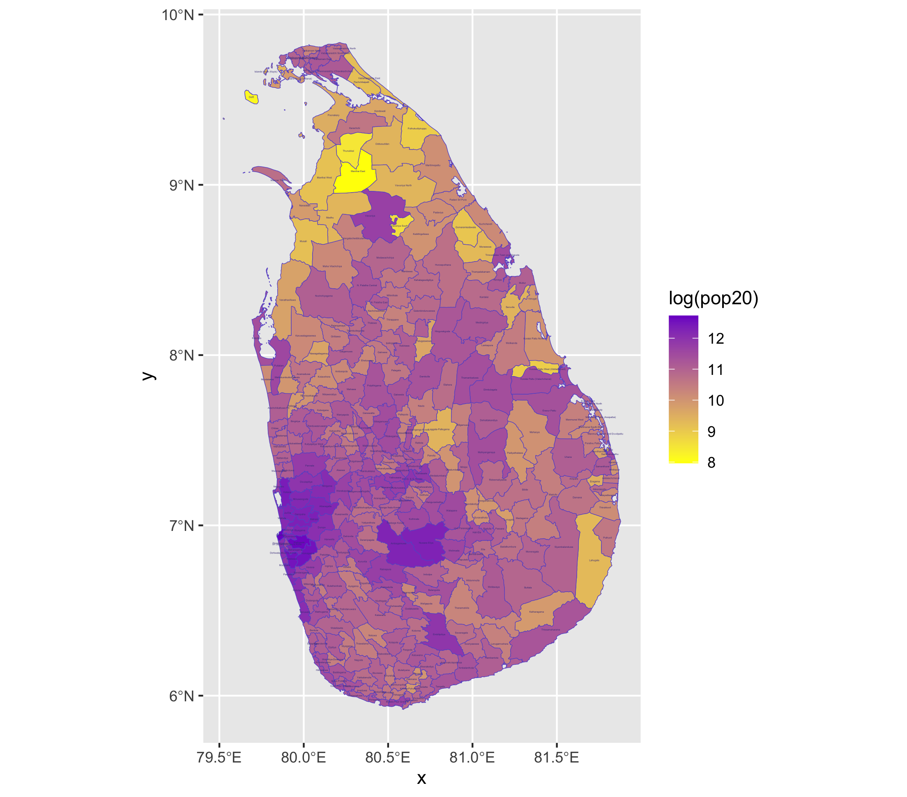
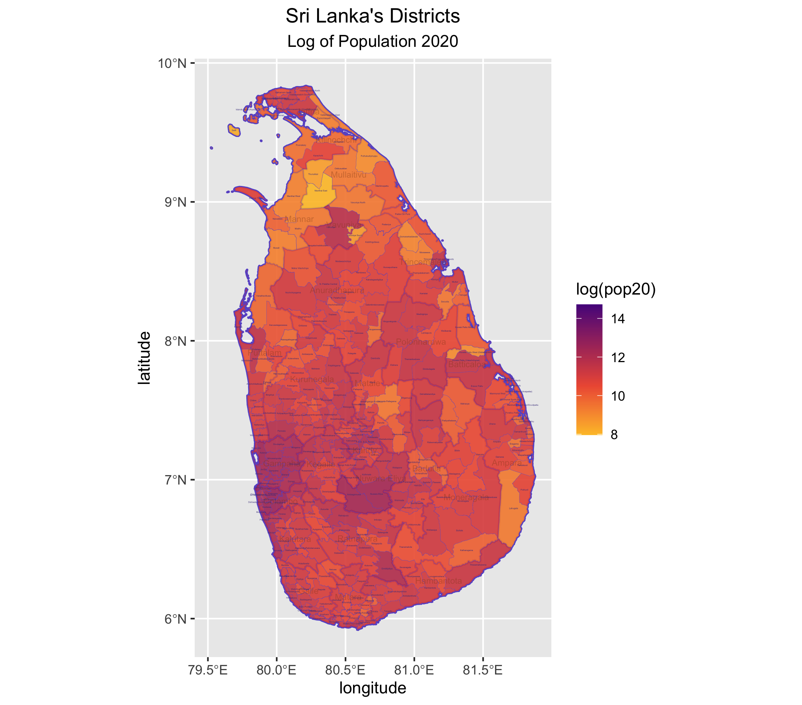

# Project 2: Extracting Populations from a Raster and Aggregating to each Unit & Creating a Geometric Bar Plot with your Simple Feature object

## 2.1 Challenge Question

## 2.1 Stretch Goal 1

## 2.1 Stretch Goal 2

## 2.1 Stretch Goal 3

## 2.2 Deliverable

## 2.2 Stretch Goal 1

