# Project 4: Modeling/Predicting Spatial Values & Investigating and Comparing Results

## Part 1

### Colombo

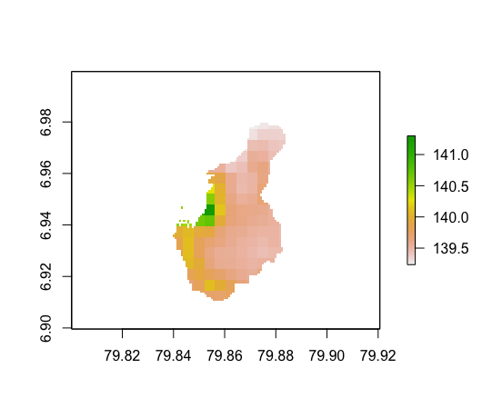
Colombo_predicted population

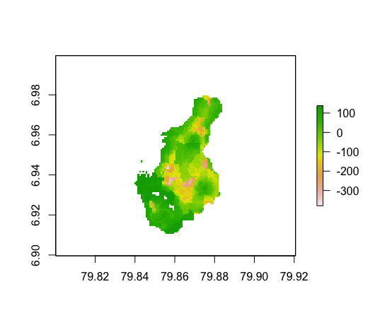
Colombo_margin of error

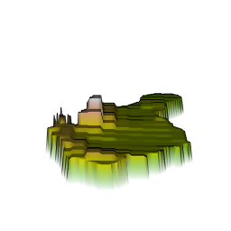

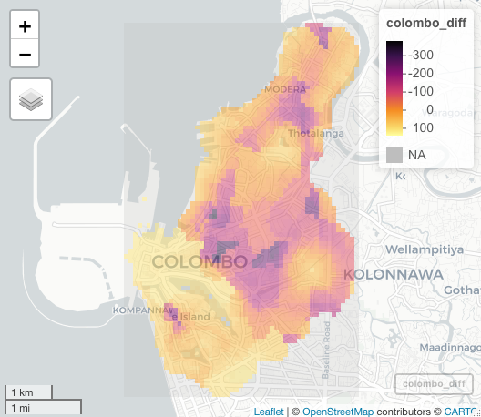

## Part 2

### predicted sum of population

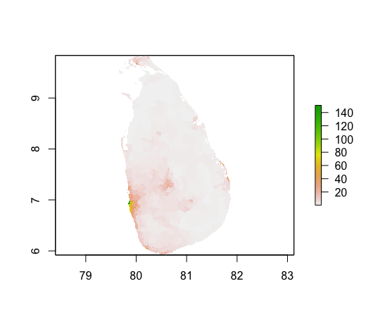

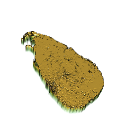

### predicted mean of population

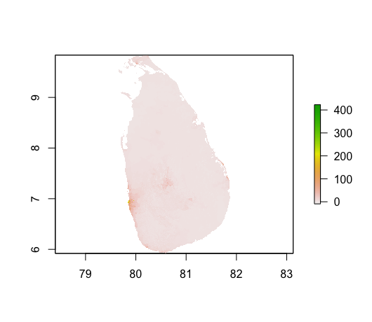

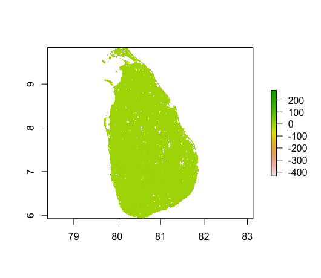

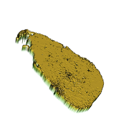

### predicted log of population

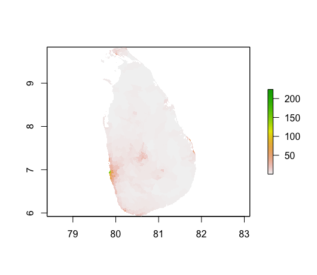

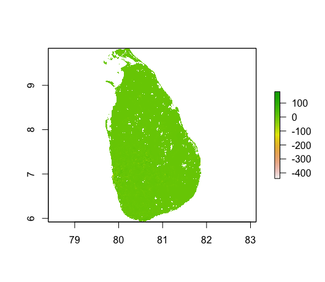

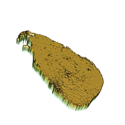

From color of the plots of differences, it is reasonable to consider that difference of mean is able to produce the best result, for its color is the closest to 0. The other two seems have deeper color, which indicates greater difference between predicted and actual. However, the 3D plots are quite similar, which means disparities between the three methods might be ignorable. That is, the three methods produce similar results.
