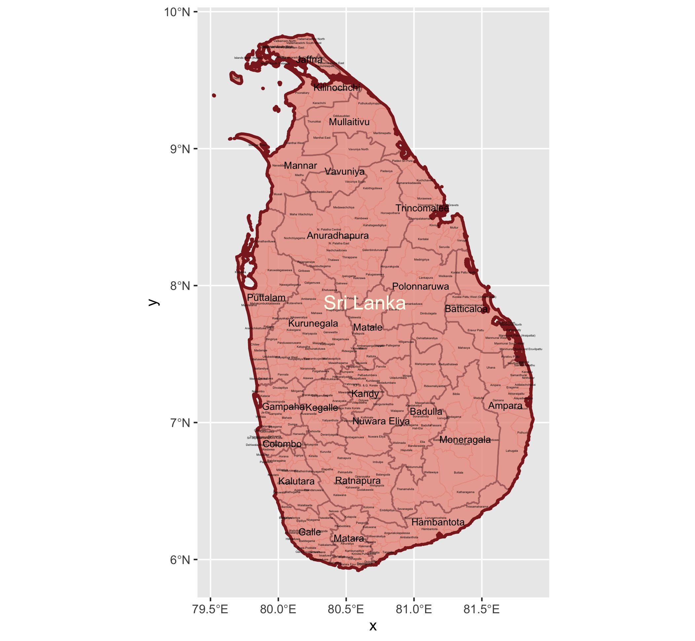
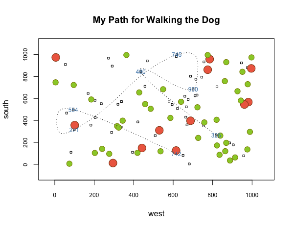

# This is my DATA 100 repository

[Self_Introduction](#Self_Introduction)

[Projects](#Projects)

[Informal_Responses](#Informal_Responses)

## Self_Introduction

Hi everyone! My name is Huiyu Chen, or you can just call me Reese.

I am from Shenzhen, a city in south of China. I graduated from an international high school here last year.

Now I have not decided what to major in, but I am interested in numbers, data and statistics. Probably I will major in
relative fields.

This is my first time taking a data science class. Definitely very excited about learning more of this subject.

## Projects

1. Projecting, Plotting and Labelling Administrative Subdivision

## Informal_Responses

1. Challenge Question: Plotting a Graph

