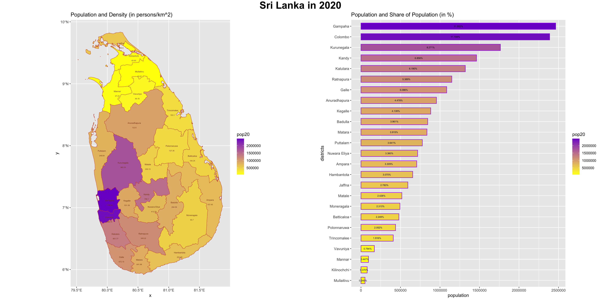
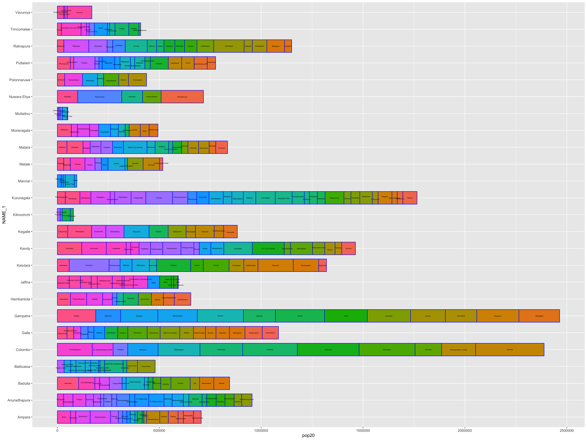
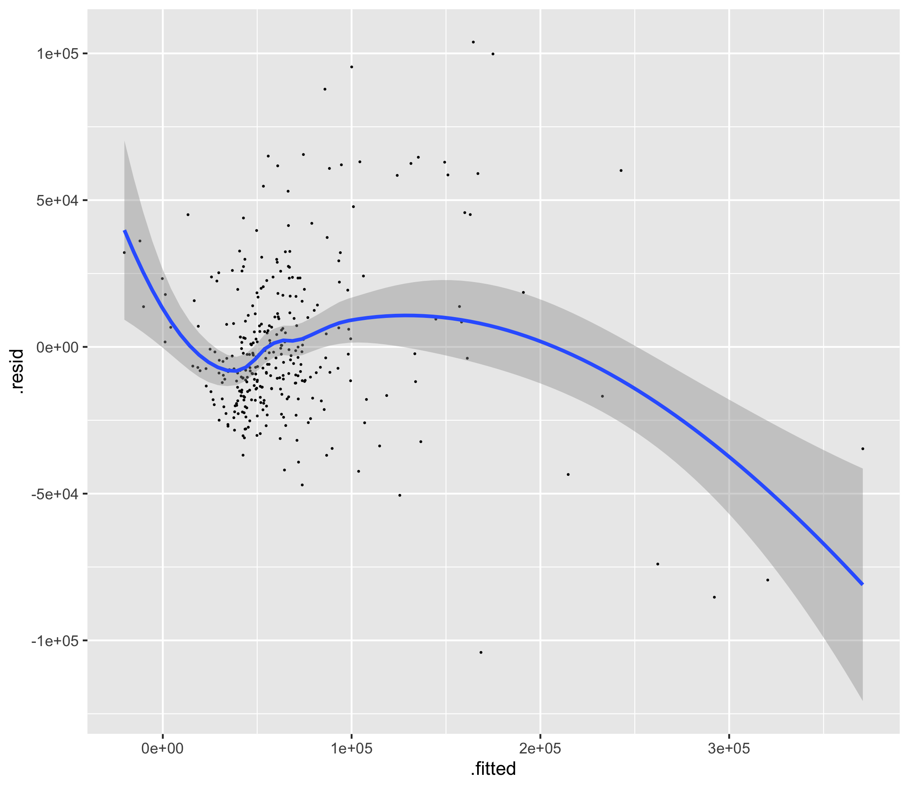
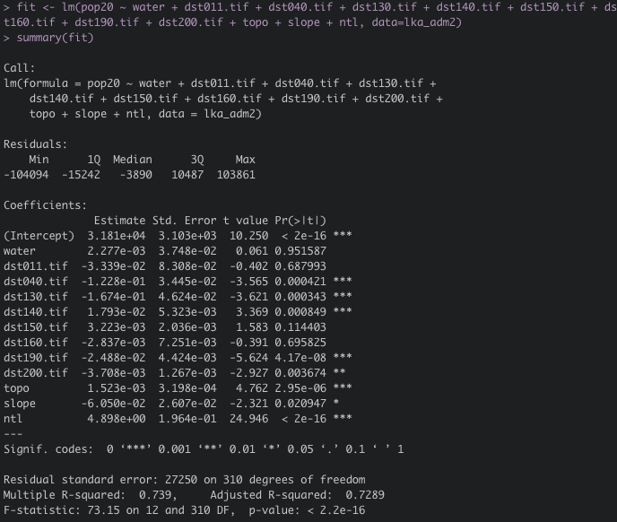

# This is my DATA 100 repository

## Self_Introduction
Hi everyone! My name is Huiyu Chen, or you can just call me Reese.

I am from Shenzhen, a city in south of China. I graduated from an international high school here last year.

Now I have not decided what to major in, but I am interested in numbers, data and statistics. Probably I will major in
relative fields.

This is my first time taking a data science class. Definitely very excited about learning more of this subject.

## Projects
  
- [Project1](#project1)
  
- [Project2](#project2)

- [Project3](#project3)

- [Project4](Project4.md)

## Informal_Responses

- [ChallengeQuestion](#challengequestion)

- [Reflection1](#reflection1)

- [Reflection2](#reflection2)

- [Reflection3](#reflection3)

## Projects

### Project1

#### Challenge Question

#### Individual Stretch Goal 1

This is plotted by data from HDX. The data is contributed by Information Technology Outreach Services(ITOS), which is an organization carries out
all kinds of services and research in different regions and cities. Therefore, it should be a secondary source.
Data from GADM are also contributed by different database. It should be a secondary source as well.

#### Individual Stretch Goal 2

### Project2

#### 2.1 Challenge Question

#### 2.1 Stretch Goal 1

#### 2.1 Stretch Goal 2

#### 2.1 Stretch Goal 3

#### 2.2 Deliverable

#### 2.2 Stretch Goal 1

### Project3

#### Challenge Question 1

#### Challenge Question 2

## Informal_Responses

### ChallengeQuestion

### Reflection1

[GitHub](Reflection1.md)

### Reflection2

[GitHub](Reflection2.md)

### Reflection3

[GitHub](Reflection3.md)
