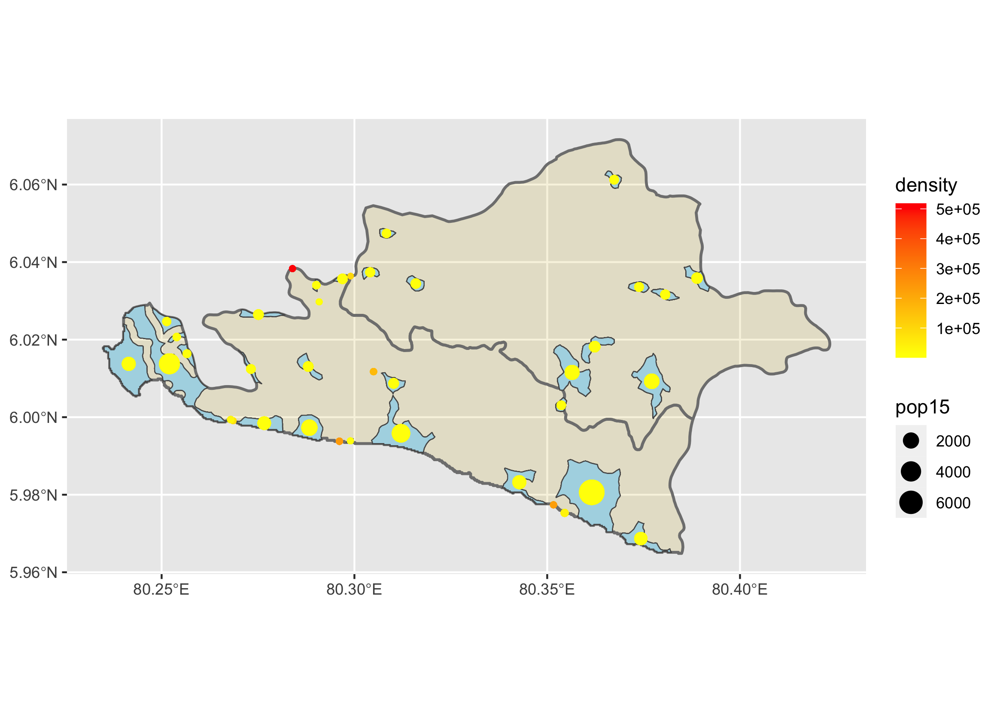
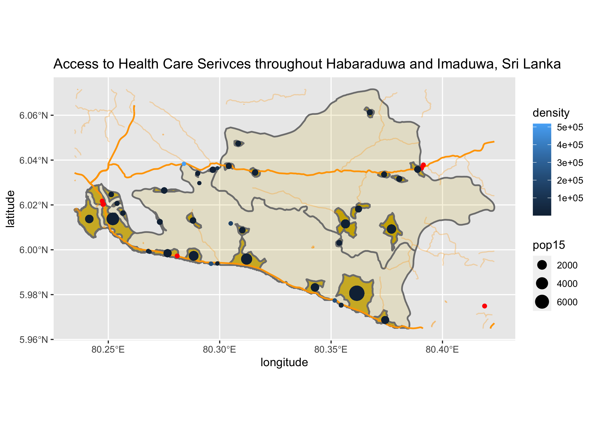
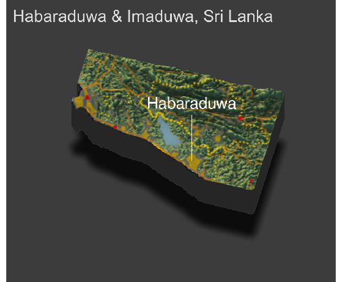

# Final Project

## Accessibility 1

## Accessibility 2

Totoal population of Habaraduwa and Imaduwa in Galle District of Sri Lanka is 108745. The most dense part of population are gathering near the sea, which is the south of the area. There are three biggest inhabitants, and they are all near the sea. Sri Lanka's most populated place is its capital, Colombo, which is the neighbour of Galle. As a result, the left part of Galle, which is close to Colombo, is populated more densely compare to other area in the district. Besides, the border which is adjacent to the sea is heavily populated as well. For the roads, they appear where people are living. Along with the south border there is a main road passing through. Another main road also connects populated areas in the middle of Imaduwa. Health care facillities is following the same rule as well. There asre only few of these in this area, and people can only get access to them in urban area, like the left of the area. There is also some on the coastline, and fewer in the inner land.

## Accessibility 3

